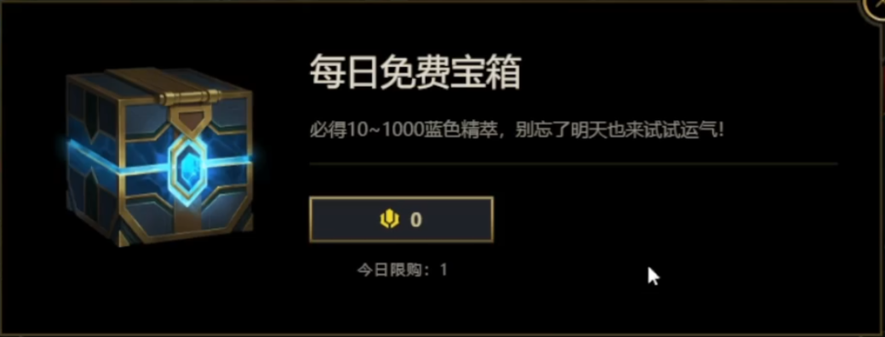

多人协作

## 问题

今天策划提出了一个每日免费礼包的需求, 类似 LOL 的每日免费宝箱  

这个需求策划想要加在商店这个界面中, 需求本身很简单, 但我却犯了难

作为服务器程序, 我不想这种需求放在商店中, 因为这不符合交易这个概念  
商店用于以物易物, 免费的购买不仅会破坏代码的安全, 同时也不好记录到交易记录中

## 沟通

于是我找到策划, 沟通其必要性, 如果是要一个每日奖励之类的机制, 可以用其他方式实现  
但得到的回复是不行, 因为将其加入商店是为了引导用户点击商店  
我大概可以理解为什么这么做, 培养用户习惯, 提供商品曝光之类的... 我认为这是个合理的需求

于是我想是否可以客户端可以做特殊的处理, 比如当成是特殊任务配置, 但是入口在商城  
但客户端也犯了难, 因为这意味着要为这种机制做一种完全不同于其他商品的逻辑  
我并不好要求对方这么做, 如果换位思考的话, 我也觉得这么做代码很难看

- 我想要代码的安全, 可维护, 这没有问题
- 策划想要通过这个功能尝试提高付费, 这也没有问题
- 客户端觉得这种做法不好维护, 从技术的角度我认为这也没有问题

这可能是团队合作经常遇到的场景, 不同职位的人出于自身职责的考虑, 都是正确的, 但无法形成共识

## 解决

最后我们解决了这个问题, 方式是加入一种虚拟货币, 每日购买花费1个币  
三方的问题的解决了, 通过一些彼此都能接受的方式:

- 我维护了代码的安全, 只是需要增加一种货币
- 策划的需求实现了, 只是需要配置一种新货币
- 客户端不必写完全不同的一套代码, 只是需要为这种新货币在商店界面中的显示做一下处理

---

最后, 我认为**协作的本质是交易**  
出于自身职责, 维护自身想要维护的东西. 同时考虑到他人的需求, 尝试牺牲一些不重要的东西以达成共识  
这是很简单的道理, 在社会中无意识都会用到
